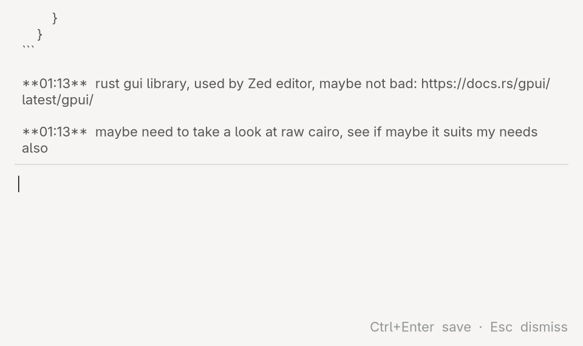

# TO-DAY
It's like "TODO", but "TODAY". Get it?

Wayland quick-note input that appends jotted-down notes into `~/Catch-all/YYYY_MM_DD.md` in a `**HH:MM** {content}` format.

Optionally accepts a target folder as an argument — notes can be sent to one of the two destinations:

```
to-day {TARGET_FOLDER}
```

- **Ctrl+Enter** — save to `TARGET_FOLDER` (or `~/Catch-all/` if none supplied)
- **Alt+Enter** — always save to the default `~/Catch-all/`
- **Esc** — dismiss



### Why
I don't keep a log of what I work on, have done, or plan to do — and that's a problem. Capture fails because organizing loose, rolling items feels hopeless. With an LLM-assisted inbox that sorts them every morning, it doesn't.

---

# Install

### Dependencies

Requires GTK4 and gtk4-layer-shell system libraries. On Fedora:
```sh
sudo dnf install gtk4-devel gtk4-layer-shell-devel
```
(have instructions for your repo? happy to add - make an issue with them!)

### Build and install

```sh
git clone https://github.com/Taugeshtu/TO-DAY
cd TO-DAY
cargo install --path . --root ~/.local
```

This puts `today` in `~/.local/bin/` — make sure it's on your `$PATH`:
```sh
# in ~/.bashrc or ~/.zshrc
export PATH="$HOME/.local/bin:$PATH"
```

### Hook it up to your compositor

Pick a key combo and bind it to `to-day`. Examples:

**Hyprland** (`~/.config/hypr/hyprland.conf`):
```
bind = $mainMod, N, exec, to-day
bind = $mainMod, M, exec, to-day /home/projects/work/thang
```

**Sway** (`~/.config/sway/config`):
```
bindsym $mod+n exec to-day
bindsym $mod+m exec to-day /home/projects/work/thang
```

---

# Version history

#### #future
- [ ] Configurable default path and format
- [ ] Better scroll of today's notes
- [ ] Surface an error when file creation fails

#### #v0_2_0
- [x] Optional `TARGET_FOLDER` argument
- [x] Ctrl+Enter → target (or default); Alt+Enter → always default

#### #v0_1_0
- [x] Works as a concept
